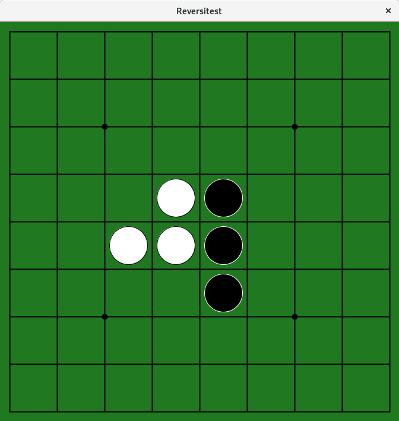

# reversiboard_rp
Reversi game board for ruby-processing

## abstract

  - ruby-processing でリバーシ（いわゆるオセロゲーム）を作る際の
	グラフィカルな表示を目的としたゲーム盤クラスです。
  - 表示だけでなくある程度のゲーム開発支援機能（石の数を数える、
	ある場所に置けるかチェック、置いてルールに則りひっくり返す等）も
	提供します。もちろん使わなくても構いません。

## how to use?

ruby-processing ようのスクリプトを以下のように作成します。
で、その後は `draw` なり `mouse_clicked` なりで `$rb` を
レシーバとして各種メソッドは発行すれば ok です。

簡単な例としては付属の `reversitest.rb` をご覧ください。

```ruby
require "./reversiboard"
$rb = ReversiBoard.new(self)
```
## documents

yard 形式でコメント入れているので `yardoc reversiboard.rb` で
作成してください。


